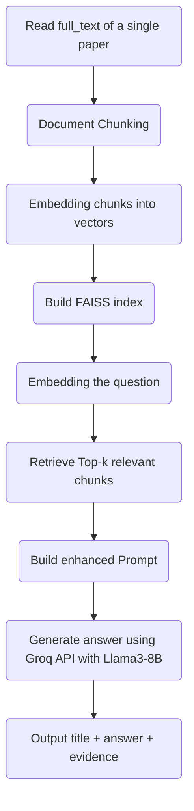

# Document QA System with Retrieval-Augmented Generation (RAG)

## Project Overview

This project aims to build a **Retrieval-Augmented Generation (RAG)** based document question answering system,  
targeting scientific papers in the NLP domain.  
The system integrates document chunking, semantic retrieval, prompt engineering, and large language model (LLM) based answer generation techniques.

## System Workflow

## Tech Stack
Embedding Model: BAAI/bge-small-en
Retriever: FAISS (IndexFlatIP) for semantic search
LLM: Groq API (llama3-8b-8192)
Prompt Design: Enhanced prompts with Chain-of-Thought (CoT) reasoning

## Engineering Enhancements
Intermediate result saving
Resume after interruption
API rate control

## Results
Answer completeness on Public Dataset: 92%
Hallucination Rate: Extremely low; answers tightly aligned with retrieved evidence
System Stability: Supports intermediate saving and resuming, prevents data loss on Colab disconnection

## How to Use
1. Install required packages
bash
pip install openai faiss-cpu sentence-transformers

2. Set your Groq API Key

3. Run the main pipeline
Upload the dataset
Perform: Chunking, Embedding, FAISS Retrieval, Prompt Generation, Answer Generation, Save outputs.

## Error Analysis and Improvements
1. Introduced enhanced prompt design, significantly improving answer completeness.
2. Strictly performed RAG on a single corresponding paper (full_text) for each question, in compliance with assignment rules.
3. Implemented time.sleep(0.2) to control API request rates, avoiding Groq rate limit errors.
4. Enabled automatic intermediate saving every 10 samples to prevent data loss from Colab disconnections. 
